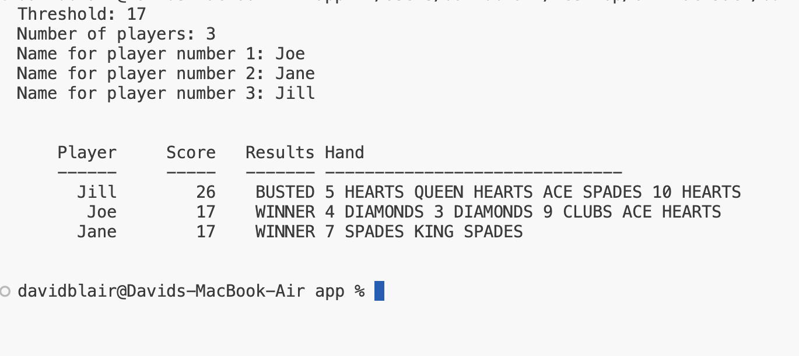
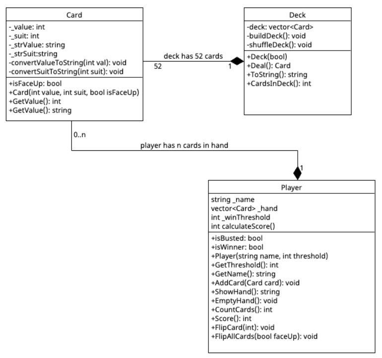

# CPP Blackjack Game

## Specifications

The Blackjack application will start by asking the application user how many players are playing the game simulation. Then the application will ask for the first name of all the players. There is no limit to how many player that will play the game. That in mind, does the number of players present any constraints that you can think of? After enter names for all players, the application will play a game simulation for every player. Each player will start with 2 cards, then one at a time, each player will calculate their hand value. Then take another card and recalculate their had value until their hand value is greater than or equal to the threshold. After all players have completed their turns, all players score will be evaluated. They will either have "busted" (gone over 21), or have a score that is compared to all other scores and ranked accordingly. A tie does not matter which player is ranked above another. After all calculations present the game results in a user friendly way (see image).



## UML

u

## Constraints

The developers are required to use the following tools:

### Application Tools

-   cmake/make/g++/clang
-   gtest
-   doxygen
-   project folders
    -   app - main game
    -   inc - h & hpp
    -   src - cpp
    -   tests - googletest
    -   docs - Doxygen

## Algorithm Considerations

1.  How will you calculate a players hand if an Ace, or even several Aces, can be a 1 or 11, depending on if it helps the user's score?
2.  How will the game decide on if a player, or many players, will take another card or not if the game runs without user input?
3.  How will the application decide who wins the game, who ties, who is busted?
4.  How many players can there be?

## gTest (googletest)

Using gtest can be very involved. We will use a subset of functionality to get our feet wet in unit testing. I will cover how to set up a test fixture in class.

## Compilation

-   This project uses cmake to compile to blackjack and blackjacktests executables
-   C++ 14 is required, CMake 3.14 is required. These are googletest constraints.
-   To compile, cd to the main directory where the root CMakeLists.txt document is
-   cmake -S . -B build
-   cmake --build build
-   The game application will be in the build/app folder
-   The test fixture will be in the build folder

## Style Guide

-   All private class properties begin with an underscore and uses camel-case
-   All public class properties begin with an uppercase letter
-   All private class functions begin with a lowercase letter
-   All public class functions begin with an uppercase letter
-   boolean variables begin with "is"
-   Any const variables are all uppercase with an underscore between works
-   Any public functions begin with an uppercase letter

## Doxygen

Type: `doxygen --version` to see if you have doxygen already installed. If not, you can install on Ubuntu by using `sudo apt-get install doxygen` or by going to https://www.doxygen.nl/download.html.

Create a folder called: `docs` in your project folder. <br>
Then, in the docs directory, type: `doxygen -g` to generate a `Doxyfile` <br>

Create a file called `mainpage.dox` in the root directory of your project and copy-paste the following text (you can change to test to alter a welcome screen: `index.html`):

```
/*! \mainpage C++ Blackjack Simulation Console Application
 *
 * \section intro_sec Introduction
 *
 * This is a blackjack simulation that runs N number of player simulations over one game.
 *
 * \section install_sec Installation
 *
 * To compile and run you will need g++, cmake, and googletest install.<br>
 * From a terminal window in the root directory create a directory called build. Then at a terminal<br>
 * window, type: cmake -S . -B build<br>
 * Then to compile: cmake --build build<br>
 * The blackjack binary should at: build/app/blackjack<br>
 * The unit tests binary should at: build/tests/blackjacktests<br>
 *
 */
```

Then open the Doxyfile and change the following:

-   PROJECT_NAME        BlackJack
-   PROJECT_NUMBER      0.1.0
-   PROJECT_BRIEF       "Description"
-   EXTRACT_PRIVATE     YES
-   HIDE_UNDOC_MEMBERS  YES
-   INPUT               ../
-   RECURSIVE           YES
-   EXCLUDE             ../build ../tests

### Generate Doxygen Files

-   Make sure that at the terminal window you are in the `docs` folder
-   Type: `doxygen` and this will generate an html folder with all the doxygen documentation in it. Change directory into the `html` folder and open the `index.html` file to see the documentation.
